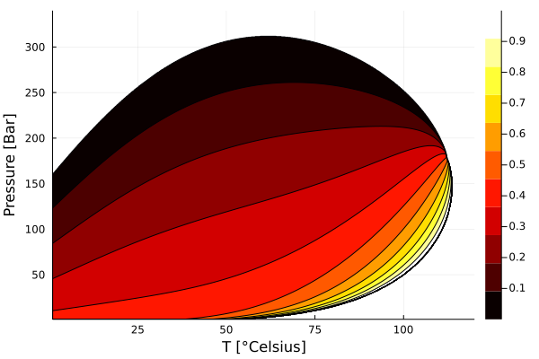

# Advanced usage

These are intended as more advanced examples for users who may want to use `MultiComponentFlash` as a part of another code, or get better performance by pre-allocating buffers. Please read [Basic usage](@ref) first.

## Avoiding allocations

```@meta
DocTestSetup = quote
    using MultiComponentFlash
    decane = MolecularProperty("n-Decane")
    methane = MolecularProperty("Methane")
    mixture = MultiComponentMixture((methane, decane))
    eos = GenericCubicEOS(mixture, PengRobinson())
    m = SSIFlash()
    # Define conditions to flash at
    p = 5e6        # 5 000 000 Pa, or 50 bar
    T = 303.15     # 30 °C = 303.15 °K
    z = [0.4, 0.6] # 1 mole methane per 9 moles of decane
    conditions = (p = p, T = T, z = z)
    # Perform a flash to get the vapor fraction
    V, K, report = flash_2ph(eos, conditions, extra_out = true, method = m)

    S = flash_storage(eos, conditions, method = m)
    @allocated V = flash_2ph!(S, K, eos, conditions, method = m)
end
```

If many flashes of the same mixture are to be performed at different conditions, you may want to pre-allocate the storage buffers for the flash:

```jldoctest
m = SSIFlash()
K = zeros(number_of_components(eos))
S = flash_storage(eos, conditions, method = m)
@allocated flash_2ph!(S, K, eos, conditions, method = m)

# output

16
```

## Immutable performance and GPU use

[`flash_2ph_immutable`](@ref) is the public interface to the fully static SSI path.
It is useful when the component count is small and fixed, particularly inside CPU
or GPU kernels. Convert the EOS once with [`static_eos`](@ref), and provide the
overall composition as an `SVector`:

```julia
using BenchmarkTools, MultiComponentFlash, StaticArrays

eos_static = static_eos(eos)
conditions_static = (p = p, T = T, z = SVector{length(z)}(z))

V, K = flash_2ph_immutable(eos_static, conditions_static)
@btime flash_2ph_immutable($eos_static, $conditions_static)
```

`V` is the scalar vapor fraction and `K` is an `SVector`. All working vectors are
immutable values local to the call; the input `conditions_static.z` must also be an
`SVector`. The implementation currently supports `GenericCubicEOS` with
`SSIFlash`, and compilation is specialized on the number of components.

The two-argument form creates the static storage marker automatically. It can also
be constructed once and passed as the final positional argument:

```julia
storage = flash_storage(eos_static, conditions_static; static = true)
V, K = flash_2ph_immutable(eos_static, conditions_static, storage)
@btime flash_2ph_immutable($eos_static, $conditions_static, $storage)
```

Static storage is a zero-size immutable marker rather than a mutable work buffer,
so constructing it inline normally compiles away and does not allocate. Passing it
explicitly can still be convenient when setting up a kernel. For example, each
kernel work item can construct its conditions and call:

```julia
conditions_i = (p = pressure[i], T = temperature[i], z = z_static)
V, K = flash_2ph_immutable(eos_static, conditions_i, storage)
```

Do not share ordinary mutable storage from `flash_storage(...; static = false)`
between kernel work items.

## Generate and plot a phase diagram

We create a three-component mixture and flash for a range of pressure and temperature conditions:

```julia
using MultiComponentFlash, Plots
ns = 1000
ubar = 1e5
# Pressure range
p0 = 1*ubar
p1 = 120*ubar
# Temperature range
T0 = 273.15 + 1
T1 = 263.15 + 350
# Define mixture + eos
names = ["Methane", "CarbonDioxide", "n-Decane"]
props = MolecularProperty.(names)
mixture = MultiComponentMixture(props)
eos = GenericCubicEOS(mixture)
# Constant mole fractions, vary p-T
z = [0.3, 0.1, 0.6]
p  = range(p0, p1, length = ns)
T = range(T0, T1, length = ns)
cond = (p = p0, T = T0, z = z)

m = SSIFlash()
S = flash_storage(eos, cond, method = m)
K = initial_guess_K(eos, cond)
data = zeros(ns, ns)
for ip = 1:ns
    for iT = 1:ns
        c = (p = p[ip], T = T[iT], z = z)
        data[ip, iT] = flash_2ph!(S, K, eos, c, NaN, method = m)
    end
end

contour(p./ubar, T .- 273.15, data, levels = 10, fill=(true,cgrad(:hot)))
ylabel!("Pressure [Bar]")
xlabel!("T [°Celsius]")
```



### PVT table generation

There is experimental support for generating simulator input blackoil tables (e.g. PVTG/PVDG and PVTO/PVDO).

```@docs
generate_pvt_tables
```
